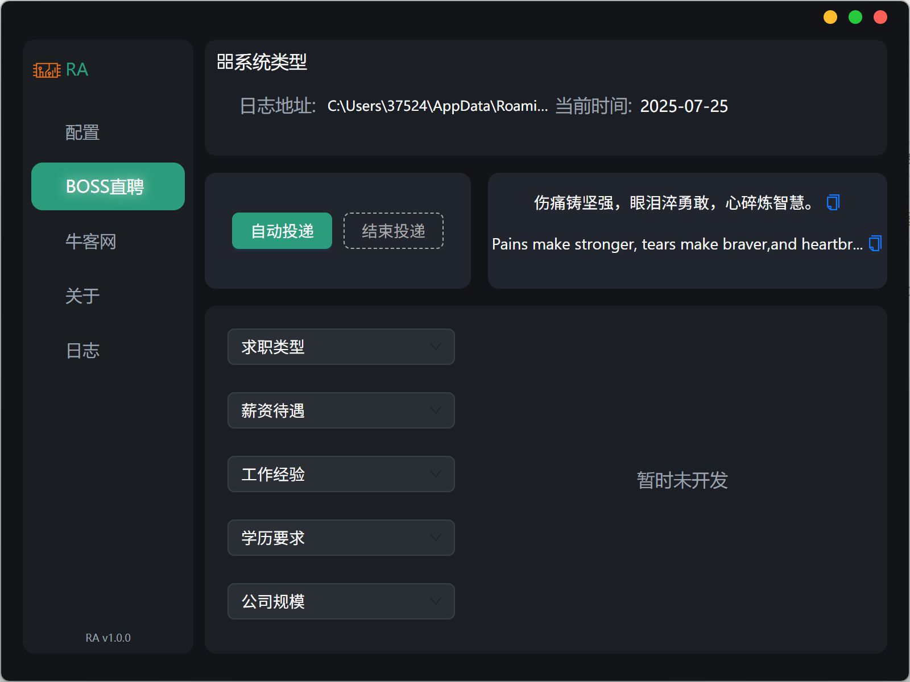
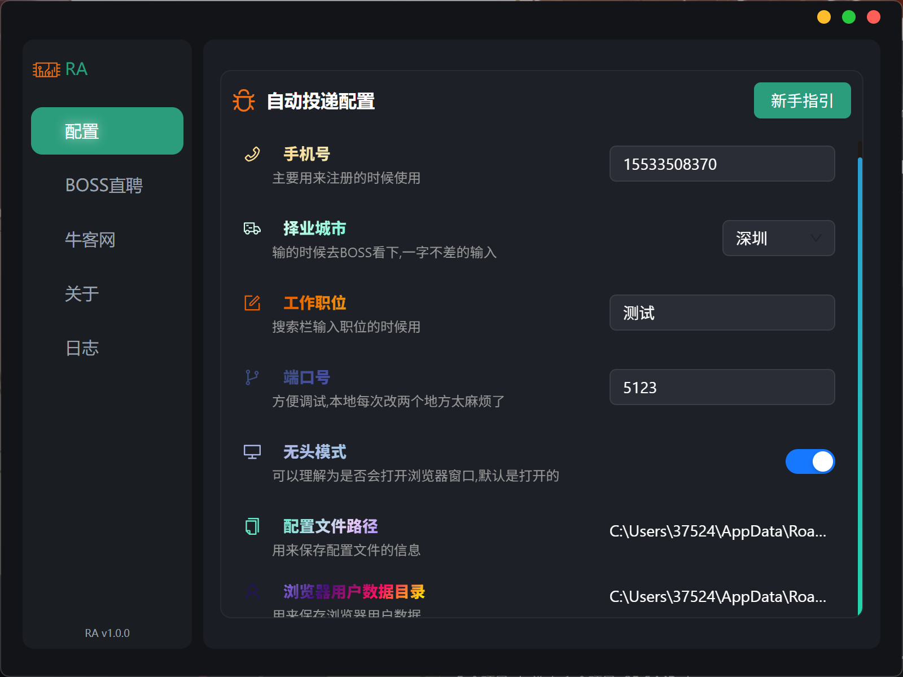
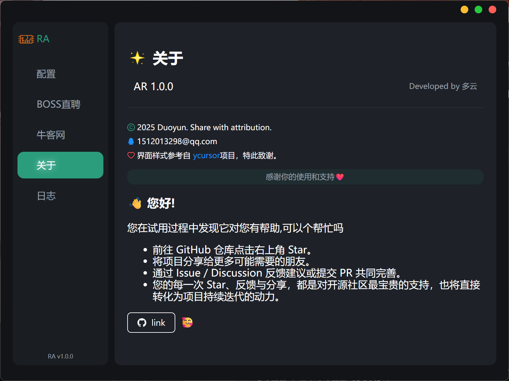
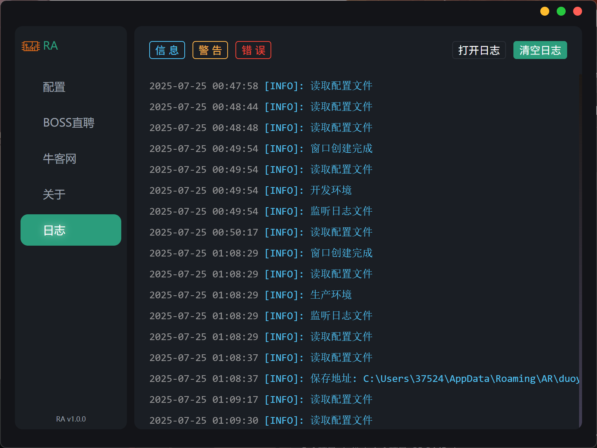

  <h1> RA：你的求职好助手</h1>
  

      开源免费，在你工作的时候帮你自动投递简历，为您快速了解市场行情，为跳槽加薪早做准备。
  

## ✨ 功能特性

| 模块                  | 功能                                        |
| :-------------------- | :------------------------------------------ |
| **🤖 AI 核心**        | 基于`Electron`+`Node.js`+`React`+`Vite`架构 |
| **📄 自动投递简历**   | 全自动化投递,节省大量时间                   |
| **💼 岗位匹配、契合** | 保存您之前选择,根据选择自动投递海量岗位     |
| **📦 便捷部署**       | 提供软件包,安装即用,内部自带新手教程        |

## 🚀 快速启动

- 安装即用点击链接或复制整段内容，/~da3a37VdXs~:/链接
  ：https://pan.quark.cn/s/c4a28b91d6f4

## 🤝 欢迎贡献

我们热烈欢迎任何形式的贡献！如果您对这个项目感兴趣，可以通过以下方式参与：

- ⭐ 给项目一个 **Star**！
- 🤔 在 **Issues** 中提出问题或建议。
- 💡 提交 **Pull Request** 改进代码或文档。

我们相信，通过社区的力量，可以让 Prisma-AI 变得更加强大。

## 项目截图

 
 
